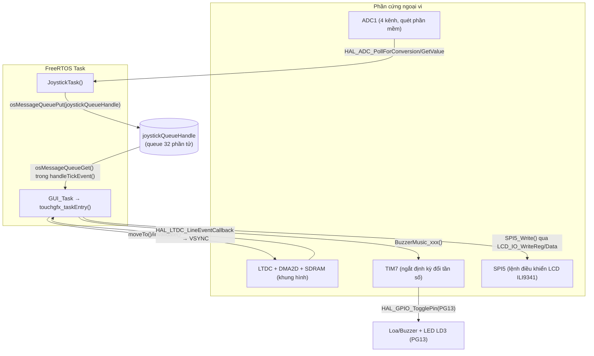
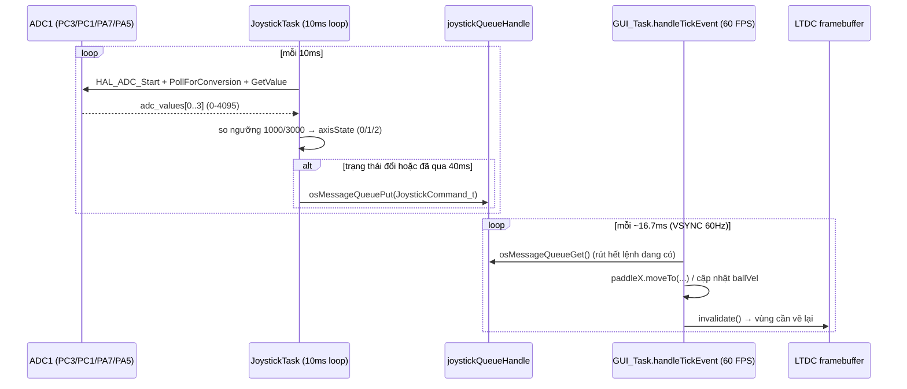
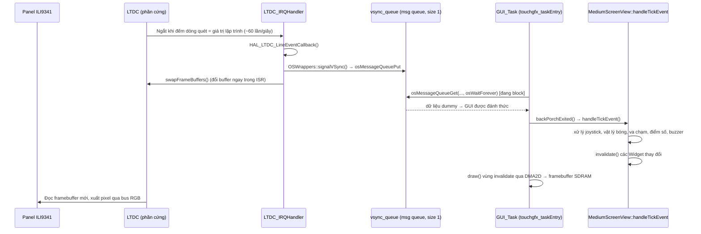
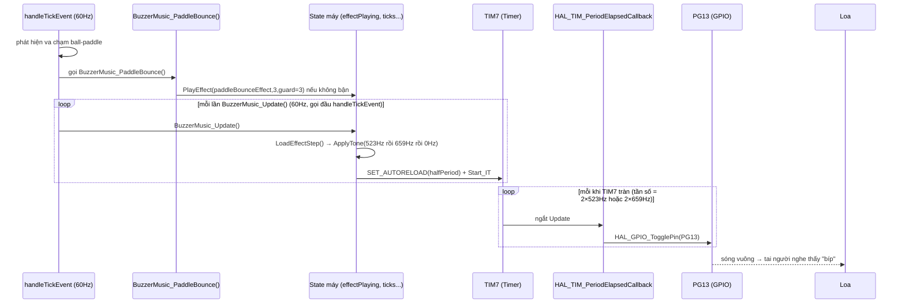

# BÁO CÁO LUỒNG HOẠT ĐỘNG CHI TIẾT — GAME PING-PONG STM32F429I-DISCO

> Tài liệu này mô tả **chính xác theo code thật** (không suy đoán) luồng dữ liệu của 3 nhóm chức năng
> chính: (1) đọc Joystick điều khiển vật thể, (2) hiển thị màn hình qua TouchGFX, (3) xuất âm thanh Buzzer.
> Mỗi phần đều trả lời: **biến nào → gọi hàm nào → ra chân nào → cơ chế phần cứng nào xử lý → phản hồi
> ngược lại bằng cách nào**.
>
> Nguồn tham chiếu: `Core/Src/main.c`, `STM32CubeIDE/Application/User/joystick_task.cpp`,
> `Core/Inc/joystick_task.h`, `Core/Inc/buzzer_music.h`,
> `TouchGFX/gui/src/mediumscreen_screen/MediumScreenView.cpp`,
> `TouchGFX/gui/src/easyscreen_screen/EasyScreenView.cpp`,
> `TouchGFX/App/app_touchgfx.c`, `TouchGFX/target/generated/TouchGFXGeneratedHAL.cpp`,
> `TouchGFX/target/generated/OSWrappers.cpp`.

---

## 0. TỔNG QUAN KIẾN TRÚC — 3 TASK FreeRTOS CHẠY SONG SONG

Toàn bộ game chạy trên FreeRTOS (CMSIS-OS v2), khởi tạo trong `main()` (`Core/Src/main.c`), cả 3 task đều
ở cùng mức ưu tiên `osPriorityNormal` nên được cấp phát CPU theo kiểu round-robin/time-slicing:

| Task | Hàm vào | Stack | Vai trò |
|---|---|---|---|
| `joystickTask` | `JoystickTask()` | 128×4 word | Đọc ADC 4 kênh joystick + nút bấm, gửi lệnh vào queue |
| `GUI_Task` | `TouchGFX_Task()` → `touchgfx_taskEntry()` | 8192×4 word (lớn nhất — chứa toàn bộ engine đồ hoạ) | Vẽ màn hình, chạy logic game (vật lý bóng, va chạm, điểm số), tiêu thụ lệnh joystick, gọi hàm buzzer |
| `defaultTask` | `StartDefaultTask()` | 1024×4 word | Task mặc định của CubeMX, không có code nghiệp vụ |

Ngoài 3 task trên, có **3 ngắt phần cứng (ISR)** đóng vai trò "backbone" đồng bộ hoá toàn hệ thống:

| Ngắt | Trigger bởi | Việc làm |
|---|---|---|
| `TIM6_DAC_IRQHandler` | Timer 6 tràn theo chu kỳ 1ms | Gọi `HAL_IncTick()` → làm timebase hệ thống (thay SysTick) |
| `LTDC_IRQHandler` | Bộ điều khiển LCD (LTDC) khi quét đến dòng ảnh được cấu hình | Báo hiệu VSYNC cho TouchGFX (mục 2) |
| `TIM7_IRQHandler` | Timer 7 tràn theo tần số nốt nhạc hiện tại | Đảo mức chân buzzer PG13 (mục 3) |



---

## 1. ĐIỀU KHIỂN VẬT THỂ BẰNG JOYSTICK

### 1.1. Phần cứng & kênh ADC

File: `STM32CubeIDE/Application/User/joystick_task.cpp`

| Macro | Kênh ADC1 | Chân vật lý | Ý nghĩa |
|---|---|---|---|
| `JOY1_X_CHANNEL` | `ADC_CHANNEL_13` | PC3 | Trục X Joystick 1 |
| `JOY1_Y_CHANNEL` | `ADC_CHANNEL_11` | PC1 | Trục Y Joystick 1 |
| `JOY2_X_CHANNEL` | `ADC_CHANNEL_7` | PA7 | Trục X Joystick 2 |
| `JOY2_Y_CHANNEL` | `ADC_CHANNEL_5` | PA5 | Trục Y Joystick 2 |
| `USER_BUTTON_PIN` | GPIO input thuần | PA0 | Nút giao bóng dùng chung 2 người chơi |

ADC1 được khởi tạo 2 lần với 2 vai trò khác nhau (đây là điểm đặc biệt của project):
- `MX_ADC1_Init()` trong `main()` chỉ dựng khung `hadc1` cơ bản (`ScanConvMode = DISABLE`, `NbrOfConversion = 1`)
  — đây là phần được CubeMX "biết" tới qua khai báo hàm, nhưng cấu hình thật sự lại bị **ghi đè** ngay
  trong `JoystickTask()`.
- Ngay khi `JoystickTask()` bắt đầu chạy, nó tự cấu hình lại 4 kênh bằng `HAL_ADC_ConfigChannel()` (mỗi
  kênh `SamplingTime = ADC_SAMPLETIME_144CYCLES`, `Rank` tăng dần 1→4), sau đó **ghi thẳng vào thanh ghi**
  `hadc1.Instance->CR1 |= ADC_CR1_SCAN` và `SQR1` để bật chế độ quét 4 kênh — vì bản HAL đang dùng không
  có API tiện lợi để đổi `NbrOfConversion` sau khi `Init()` đã chạy.

### 1.2. Vòng lặp đọc giá trị — `JoystickTask(void *argument)`

Vòng lặp `for(;;)` lặp lại mỗi **10ms** (`osDelay(10)` ở cuối), theo trình tự:

1. `HAL_ADC_Start(&hadc1)` — bắt đầu quét cả 4 kênh đã cấu hình Scan.
2. Vòng `for (i = 0..3)`: `HAL_ADC_PollForConversion(&hadc1, 50)` (timeout 50ms) rồi `HAL_ADC_GetValue(&hadc1)`
   → lưu vào mảng `adc_values[4]` (giá trị 12-bit, 0–4095, tâm nghỉ ~2048).
   - Nếu poll timeout → set cờ lỗi, xoá `ADC_FLAG_OVR`, `osDelay(10)` rồi `continue` vòng lặp (bỏ qua khung
     đọc lỗi, không treo task).
3. `HAL_ADC_Stop(&hadc1)`.
4. **Tính trạng thái hướng** cho từng trục bằng ngưỡng:
   ```cpp
   uint8_t joy1XAxisState = (adc_values[1] < 1000) ? 1 : ((adc_values[1] > 3000) ? 2 : 0);
   ```
   - `adc_values[1]` (PC1, trục Y vật lý) được gán làm `joy1XAxisState` — đây là **hoán đổi trục có chủ
     đích** theo hướng lắp joystick thực tế trên khung máy (không phải lỗi).
   - Kết quả trạng thái: `0` = vùng chết (deadzone, không làm gì), `1` = lệch âm ("trái/lên"), `2` = lệch
     dương ("phải/xuống").
5. **Chống dội & giới hạn tốc độ gửi lệnh** — lambda `queueAxisCommand(axisIndex, state, negCmd, posCmd)`:
   - Nếu `state == 0`: xoá `lastAxisState[axisIndex]`, không gửi gì (joystick đã về giữa).
   - Nếu trạng thái đổi **hoặc** đã qua `JOY_REPEAT_MS = 40ms` kể từ lần gửi cuối cùng của trục đó: gọi
     `osMessageQueuePut(joystickQueueHandle, &command, 0, 0)` — đẩy 1 phần tử `JoystickCommand_t` (enum)
     vào **hàng đợi FreeRTOS `joystickQueueHandle`** (được tạo trong `main()`:
     `osMessageQueueNew(32, sizeof(JoystickCommand_t), ...)` — sức chứa 32 lệnh).
   - Cơ chế này đảm bảo: joystick giữ nguyên 1 hướng vẫn tiếp tục "bắn" lệnh đều đặn mỗi 40ms (để paddle
     trôi liên tục), nhưng không làm tràn queue bằng cách gửi ở tần suất 10ms (chu kỳ vòng lặp) x4 trục.
6. **Đọc nút bấm**: `HAL_GPIO_ReadPin(GPIOA, GPIO_PIN_0)`. Board có pull-down cứng nên nhả = `RESET`, nhấn
   = `SET`. Phát hiện **cạnh lên** (`buttonState==SET && lastButtonState==RESET`) → gửi **cả 2 lệnh**
   `JOY1_BUTTON` và `JOY2_BUTTON` vào queue (do 1 nút vật lý dùng chung 2 người chơi — bên nhận đúng lượt
   giao bóng sẽ xử lý, bên kia bỏ qua vô hại, xem mục 1.4).
7. Ghi các biến debug toàn cục `g_debug_adc[4]`, `g_debug_btn` (không dùng trong luồng game, chỉ để debug
   qua trình gỡ lỗi/UART nếu cần).

**Danh sách lệnh enum** (`Core/Inc/joystick_task.h`):
```cpp
typedef enum {
    JOY1_LEFT, JOY1_RIGHT, JOY1_UP, JOY1_DOWN,
    JOY2_LEFT, JOY2_RIGHT, JOY2_UP, JOY2_DOWN,
    JOY1_BUTTON, JOY2_BUTTON
} JoystickCommand_t;
```

### 1.3. Bên tiêu thụ — `handleTickEvent()` trong `MediumScreenView.cpp` / `EasyScreenView.cpp`

Hàm này được TouchGFX gọi **tự động mỗi khung hình (~60 lần/giây)**, đồng bộ với VSYNC LCD (xem mục 2.3).
Đầu hàm, nó rút hết lệnh đang chờ trong queue:
```cpp
JoystickCommand_t command;
while (osMessageQueueGet(joystickQueueHandle, &command, NULL, 0) == osOK) {
    switch (command) { ... }
}
```
(tham số timeout `0` → không khoá task nếu queue rỗng, rút hết bao nhiêu lệnh đang có rồi thoát vòng lặp).

**Di chuyển paddle** (ví dụ `JOY1_LEFT`):
```cpp
int16_t newY = paddle1.getY() + 2;      // cộng dồn 2px mỗi lệnh
if (newY > 198) newY = 198;             // chặn biên dưới màn hình
paddle1.invalidate();                    // đánh dấu vùng cũ cần vẽ lại
paddle1.moveTo(paddle1.getX(), newY);    // đổi toạ độ Widget
paddle1.invalidate();                    // đánh dấu vùng mới cần vẽ lại
```
→ mỗi lệnh joystick chỉ dịch paddle **2 pixel**; muốn di chuyển nhanh, `JoystickTask` phải liên tục bắn
lệnh (nhờ cơ chế lặp lại 40ms ở mục 1.2) — đây chính là "closed loop" biến ADC → tốc độ di chuyển paddle.

**Ngắm góc giao bóng** (`JOY1_UP`/`JOY1_DOWN`, chỉ có tác dụng khi `waitingForServe && servingPlayer==1`):
```cpp
desiredBallVelY1 -= 0.2f;   // hoặc += với DOWN, giới hạn [-2.0, 2.0]
lineAngle1 = atan2f(desiredBallVelY1, 2.0f) * 180.0f / M_PI;   // đổi ra góc độ để vẽ
showAimLineForPlayer(1);     // vẽ lại đường ngắm (Line widget) hướng theo góc mới
```

**Giao bóng** (`JOY1_BUTTON`, chỉ tác dụng khi đang chờ giao và đúng lượt `servingPlayer==1`):
```cpp
waitingForServe = false;
float speed = 2.0f;
ballVelX = sqrt(speed*speed - desiredBallVelY1*desiredBallVelY1);   // thành phần X luôn dương (sang phải)
ballVelY = desiredBallVelY1;                                        // thành phần Y theo góc đã ngắm
ball.setVisible(true); ball.invalidate();
hideAimLines();
```
→ Vector vận tốc bóng `(ballVelX, ballVelY)` được tính từ chính góc mà người chơi đã ngắm bằng joystick,
tốc độ tổng luôn giữ nguyên `speed = 2.0f` (bảo toàn động lượng bằng công thức Pythagoras).

### 1.4. Sơ đồ tuần tự 1 chu kỳ điều khiển



---

## 2. HIỂN THỊ MÀN HÌNH KẾT HỢP TouchGFX

### 2.1. Đường tín hiệu hình ảnh (data path)

```
SDRAM (framebuffer RGB565, qua FMC 16-bit)
    → LTDC (Layer 0, 240x320, RGB565) đọc trực tiếp từ SDRAM theo pixel clock PLLSAI (6MHz)
    → xuất ra bus dữ liệu song song tới driver LCD (chân LTDC_R/G/B, HSYNC, VSYNC, DE — nhóm PA/PB/PC/PF/PG)
    → panel ILI9341 hiển thị
```

**Riêng phần "lệnh điều khiển" LCD (khởi tạo, bật/tắt, đổi vùng ghi...) lại đi qua một đường hoàn toàn
khác** — không qua FMC song song mà qua **SPI5 bit-đơn** kết hợp 2 chân GPIO:

```c
// Core/Src/main.c
void LCD_IO_WriteReg(uint8_t Reg) {
  HAL_GPIO_WritePin(GPIOD, GPIO_PIN_13, GPIO_PIN_RESET);   // WRX=0  → đây là LỆNH (command)
  HAL_GPIO_WritePin(GPIOC, GPIO_PIN_2, GPIO_PIN_RESET);    // CS=0   → chọn chip LCD
  SPI5_Write(Reg);                                          // HAL_SPI_Transmit(&hspi5, &Reg, 1, timeout)
  HAL_GPIO_WritePin(GPIOC, GPIO_PIN_2, GPIO_PIN_SET);      // CS=1   → nhả chip
}
void LCD_IO_WriteData(uint16_t RegValue) {
  HAL_GPIO_WritePin(GPIOD, GPIO_PIN_13, GPIO_PIN_SET);     // WRX=1  → đây là DỮ LIỆU (data)
  ... SPI5_Write(RegValue) ...
}
```
→ **Lưu ý quan trọng đối chiếu với `KiemTraPhanCung.md`:** tài liệu kiểm tra phần cứng trước đó ghi PD13 là
"chưa dùng vào việc gì" — thực tế code cho thấy **PD13 CÓ được dùng làm tín hiệu WRX (Command/Data Select)
cho giao tiếp SPI với LCD**, PC2 dùng làm Chip-Select. Đây là điểm nên cập nhật lại tài liệu kiểm tra phần
cứng: PD12 vẫn không dùng, nhưng PD13 đã được dùng (chỉ là không có trong `.ioc`, viết tay trong `main.c`).

Hàm khởi tạo `MX_LTDC_Init()` cấu hình `hltdc` (polarity, timing HSYNC=9, VSYNC=1, v.v., khớp thông số
trong `KiemTraPhanCung.md`), sau đó gọi `LcdDrv = &ili9341_drv; LcdDrv->Init();` — driver BSP chuẩn của
ST dùng đúng 2 hàm `LCD_IO_WriteReg/WriteData` ở trên để gửi chuỗi lệnh khởi tạo ILI9341 (gamma, power,
memory access control...).

### 2.2. DMA2D — tăng tốc vẽ 2D

`MX_DMA2D_Init()` cấu hình `hdma2d.Init.Mode = DMA2D_M2M` (Memory-to-Memory), `ColorMode = RGB565`. TouchGFX
dùng DMA2D nội bộ (qua thư viện) để copy/blend các Widget (Box, Image, Line, TextArea...) từ bộ nhớ Flash/
RAM chứa asset vào framebuffer trong SDRAM **mà không tốn chu kỳ CPU** — CPU chỉ ra lệnh rồi đợi ngắt
`DMA2D_IRQHandler` báo hoàn tất (`HAL_DMA2D_IRQHandler(&hdma2d)` trong `stm32f4xx_it.c`).

### 2.3. Cơ chế đồng bộ khung hình — VSYNC → tick 60Hz

Đây là "nhịp tim" khiến toàn bộ game (vật lý bóng, joystick, buzzer update) chạy đúng 60 lần/giây:

1. **`LTDC_IRQHandler()`** (`stm32f4xx_it.c`) được gọi mỗi khi bộ đếm dòng quét LCD chạm giá trị đã lập
   trình (`HAL_LTDC_ProgramLineEvent`) → gọi `HAL_LTDC_IRQHandler(&hltdc)` → HAL tự động gọi callback
   `HAL_LTDC_LineEventCallback()` (định nghĩa trong `TouchGFXGeneratedHAL.cpp`):
   ```cpp
   if (LTDC->LIPCR == lcd_int_active_line) {        // vừa vào vùng ảnh active (đầu khung hình mới)
       HAL_LTDC_ProgramLineEvent(hltdc, lcd_int_porch_line);
       HAL::getInstance()->vSync();                  // báo cho engine TouchGFX 1 khung đã trôi qua
       OSWrappers::signalVSync();                    // *** GỬI TÍN HIỆU CHO TASK GUI ***
       HAL::getInstance()->swapFrameBuffers();        // đổi buffer ngay trong ISR (không đợi task)
       GPIO::set(GPIO::VSYNC_FREQ);                   // bật chân đo tần số VSYNC (PE2, debug TouchGFX)
   } else {                                            // vừa ra khỏi vùng active
       HAL_LTDC_ProgramLineEvent(hltdc, lcd_int_active_line);
       HAL::getInstance()->frontPorchEntered();
       GPIO::clear(GPIO::VSYNC_FREQ);
   }
   ```
2. **`OSWrappers::signalVSync()`** (`TouchGFX/target/generated/OSWrappers.cpp`):
   ```cpp
   static osMessageQueueId_t vsync_queue = NULL;   // queue dung lượng 1 phần tử, tạo lúc OSWrappers::initialize()
   void OSWrappers::signalVSync() { osMessageQueuePut(vsync_queue, &dummy, 0, 0); }
   ```
3. Task `GUI_Task` (hàm `TouchGFX_Task()` → `touchgfx_taskEntry()`, C++ trong `TouchGFXHAL.cpp::taskEntry()`)
   chạy vòng lặp vô hạn:
   ```cpp
   void TouchGFXHAL::taskEntry() {
       enableLCDControllerInterrupt(); enableInterrupts();
       OSWrappers::waitForVSync(); backPorchExited();
       LCD_IO_WriteReg(0x29);                 // lệnh "Display ON" gửi 1 lần qua SPI5
       for (;;) { OSWrappers::waitForVSync(); backPorchExited(); }
   }
   ```
   `OSWrappers::waitForVSync()` gọi `osMessageQueueGet(vsync_queue, ..., osWaitForever)` → **task bị block
   (không tốn CPU) cho đến khi ISR LTDC bơm tín hiệu vào queue** → đây chính là cơ chế **ngắt phần cứng
   đánh thức task FreeRTOS**, tần số quyết định bởi tần số quét dòng LCD đã lập trình trong `hltdc` (tương
   ứng khoảng 60Hz).
4. `backPorchExited()` (bên trong framework TouchGFX, không sửa) sẽ tuần tự gọi:
   `Application::handleTickEvent()` → `Screen::handleTickEvent()` → **override tại
   `MediumScreenView::handleTickEvent()` / `EasyScreenView::handleTickEvent()`** — đúng là nơi chứa toàn bộ
   logic game (đọc queue joystick, vật lý bóng, va chạm, tính điểm, gọi hàm buzzer — xem mục 1.3, 3.4) →
   sau đó framework tự vẽ (`draw()`) các vùng đã bị `invalidate()` bằng DMA2D → gọi
   `flushFrameBuffer(rect)` → `HAL::flushFrameBuffer()` đánh dấu vùng đã vẽ xong.



### 2.4. Kiến trúc Model – Presenter – View – Screen

- **`Model`** (`gui/src/model/Model.cpp`): chứa state toàn cục không thuộc riêng 1 màn hình (`winner`,
  `player1Score`, `player2Score`, `gameOver`). Có con trỏ tĩnh `staticListener` để gọi ngược lên Presenter
  khi cần (`Model::tick()` gán `staticListener = modelListener` mỗi khung hình để đảm bảo đồng bộ).
- **`Presenter`** (mỗi màn hình có 1 Presenter riêng, ví dụ `MediumScreenPresenter`): cầu nối giữa `Model`
  và `View`, có hàm `goToEndScreen(winnerId)` được `View` gọi khi 1 người đạt 11 điểm.
- **`View`** (`MediumScreenView`, `EasyScreenView`): chứa toàn bộ logic game thực tế + các Widget hiển thị
  (`ball`, `paddle1`, `paddle2`, `line1`/`line1_1` là đường ngắm, `score1`/`score2` là TextArea).
- **`ViewBase`** (sinh tự động bởi TouchGFX Designer, không sửa tay): định nghĩa vị trí/kích thước ban đầu
  của mọi Widget lấy từ file thiết kế `.touchgfx`.

Có **2 màn hình chơi khác nhau** (`EasyScreenView`, `MediumScreenView`) dùng chung gần như y hệt logic vật
lý bóng/va chạm/điểm số (khác biệt chính: `MediumScreenView` có thêm `refreshStaticBars()`/`refreshStaticScene()`
để vẽ lại các thanh/khung tĩnh xung quanh khung hình mỗi khi vùng invalidate giao với chúng — tránh hiện
tượng "để lại vệt" khi DMA2D chỉ vẽ lại vùng bị thay đổi thay vì toàn màn hình).

---

## 3. XUẤT ÂM THANH (BUZZER)

### 3.1. Vì sao không dùng PWM phần cứng

Ghi chú ngay trong code (`Core/Src/main.c`):
> *"PG13 stays a plain GPIO output for its whole life... TIM7 only supplies a periodic interrupt used to
> flip the pin; it never drives any pin itself, so there is no alternate-function pin sharing at all."*

Nói cách khác: đây là **buzzer bit-bang bằng phần mềm**, không dùng chế độ PWM/Output-Compare phần cứng của
Timer. Lý do (đọc từ comment): tránh mọi rủi ro PG13/PD12 bị FMC/LTDC "mượn" lại làm chân địa chỉ SDRAM
hoặc chân LCD, vì SDRAM-backed framebuffer đang chạy liên tục.

### 3.2. Cấu hình phần cứng

```c
#define BUZZER_TIMER_HZ 1000000U      // TIM7 clock hiệu dụng = 1MHz
#define BUZZER_GPIO_PORT GPIOG
#define BUZZER_GPIO_PIN GPIO_PIN_13   // đồng thời là LED xanh LD3 on-board

void BuzzerMusic_Init(void) {
    __HAL_RCC_GPIOG_CLK_ENABLE();
    __HAL_RCC_TIM7_CLK_ENABLE();
    gpioInitStruct.Pin = GPIO_PIN_13;
    gpioInitStruct.Mode = GPIO_MODE_OUTPUT_PP;   // GPIO output thuần, KHÔNG alternate function
    HAL_GPIO_Init(GPIOG, &gpioInitStruct);

    htim7.Instance = TIM7;
    htim7.Init.Prescaler = 90U - 1U;             // APB1 timer clock 90MHz / 90 = 1MHz
    htim7.Init.Period = 1000U - 1U;              // giá trị mặc định, sẽ bị ghi đè theo tần số nốt nhạc
    HAL_TIM_Base_Init(&htim7);
    HAL_NVIC_SetPriority(TIM7_IRQn, 6, 0U);
    HAL_NVIC_EnableIRQ(TIM7_IRQn);
}
```

### 3.3. Cơ chế phát ra một tần số (`BuzzerMusic_ApplyTone`)

```c
static void BuzzerMusic_ApplyTone(uint16_t frequency) {
    if (frequency == 0U) {                        // tần số 0 = im lặng
        HAL_TIM_Base_Stop_IT(&htim7);
        HAL_GPIO_WritePin(GPIOG, GPIO_PIN_13, GPIO_PIN_RESET);
        return;
    }
    uint32_t halfPeriod = BUZZER_TIMER_HZ / (2U * frequency);   // muốn f Hz → phải đảo mức 2×f lần/giây
    __HAL_TIM_SET_AUTORELOAD(&htim7, halfPeriod - 1U);          // nạp ARR mới ứng với f
    __HAL_TIM_SET_COUNTER(&htim7, 0U);
    if (!buzzerToneActive) {
        HAL_GPIO_WritePin(GPIOG, GPIO_PIN_13, GPIO_PIN_SET);    // bắt đầu ở mức cao
        HAL_TIM_Base_Start_IT(&htim7);                          // bật ngắt Update của TIM7
    }
}
```
Ngắt cập nhật (Update Interrupt) của TIM7 gọi vào **`HAL_TIM_PeriodElapsedCallback()`** dùng chung cho cả
TIM6 và TIM7 (`Core/Src/main.c`):
```c
void HAL_TIM_PeriodElapsedCallback(TIM_HandleTypeDef *htim) {
    if (htim->Instance == TIM6) {
        HAL_IncTick();                                    // timebase hệ thống (không liên quan buzzer)
    } else if (htim->Instance == TIM7) {
        HAL_GPIO_TogglePin(GPIOG, GPIO_PIN_13);            // *** ĐÂY LÀ NƠI THỰC SỰ TẠO ÂM THANH ***
    }
}
```
→ Mỗi lần TIM7 tràn (chu kỳ = `halfPeriod` µs), chân PG13 đảo mức 1 lần → tạo **sóng vuông tần số
`frequency` Hz** đưa ra loa/buzzer gắn ở PG13. Toàn bộ việc "phát nhạc" chỉ là liên tục thay đổi
`halfPeriod` (tức thay đổi ARR của TIM7) theo thời gian.

### 3.4. Máy trạng thái "nhạc nền + hiệu ứng chèn" (`BuzzerMusic_Update`, gọi mỗi khung hình 60Hz)

Dữ liệu nốt nhạc là mảng `BuzzerStep{ frequency, ticks }` (mỗi "tick" = 1 lần gọi `BuzzerMusic_Update()`,
tức ~1/60 giây):

| Mảng | Dùng khi | Nội dung |
|---|---|---|
| `backgroundLoop[]` | Nhạc nền lặp lại liên tục suốt ván đấu | 36 bước, giai điệu tự soạn, có khoảng nghỉ (`{0, n}`) chen giữa mỗi nốt để tránh 2 nốt dính liền nghe như 1 tiếng "nháy đúp" (đồng thời tránh LED PG13 nháy đúp vì LED và buzzer dùng chung chân) |
| `scoreAccent[]` | Khi có người ghi điểm | `{659,2},{784,2},{988,3},{0,1}` — chuỗi 3 nốt tăng dần, `guardTicks=2` |
| `paddleBounceEffect[]` | Bóng chạm paddle | `{523,1},{659,1},{0,1}` — 2 nốt ngắn, `guardTicks=3` |
| `wallBounceEffect[]` | Bóng chạm tường trên/dưới hoặc biên ngoài khung thành | `{392,1},{0,1}` — 1 nốt, `guardTicks=3` |

Logic ưu tiên trong `BuzzerMusic_Update()`:
```c
void BuzzerMusic_Update(void) {
    if (effectGuardTicks > 0) effectGuardTicks--;      // đếm ngược thời gian "khoá" hiệu ứng mới
    if (!effectPlaying && !loopPlaying) return;         // im lặng hoàn toàn (BuzzerMusic_Stop() đã gọi)

    if (effectPlaying) {                                // ƯU TIÊN 1: hiệu ứng đang phát (điểm/paddle/tường)
        if (effectTicksRemaining == 0) {
            BuzzerMusic_LoadEffectStep();               // nạp nốt kế tiếp trong mảng effect
            if (!effectPlaying) {                        // hết mảng effect
                BuzzerMusic_ApplyTone(0);
                loopTicksRemaining = 0;                  // ép nhạc nền nạp nốt mới ngay, không nối nửa nốt cũ
                return;
            }
        }
        effectTicksRemaining--;
        return;                                          // effect đang phát thì KHÔNG chạy nhạc nền cùng lúc
    }

    if (loopPlaying) {                                   // ƯU TIÊN 2: nhạc nền chạy khi không có effect
        if (loopTicksRemaining == 0) BuzzerMusic_LoadLoopStep();
        loopTicksRemaining--;
    }
}
```
→ Cơ chế: **hiệu ứng (điểm/paddle/tường) luôn đè lên nhạc nền**, và `effectGuardTicks` (2–3 tick ≈ 33–50ms)
ngăn 2 hiệu ứng chồng lấn liên tiếp (ví dụ bóng chạm 2 tường liên tục trong 1 khung hình chỉ phát 1 tiếng).

**Nơi gọi các hàm hiệu ứng** (trong `handleTickEvent()` của `MediumScreenView.cpp`/`EasyScreenView.cpp`,
xem mục 1.3/2.3):
```cpp
if (ballY < 0 || ballY + ball.getHeight() > 240) { ballVelY = -ballVelY; BuzzerMusic_WallBounce(); }
if (va chạm paddle1/paddle2) { applyPaddleBounce(...); BuzzerMusic_PaddleBounce(); }
if (score1++ / score2++) { BuzzerMusic_Accent(); if (score>=11) { gameOver=true; presenter->goToEndScreen(...); } }
```
Mỗi hàm public (`BuzzerMusic_WallBounce/PaddleBounce/Accent`) chỉ gọi `BuzzerMusic_PlayEffect(mảng, độ
dài, guardTicks)` — hàm này kiểm tra nếu đang có effect khác chạy hoặc còn trong thời gian guard thì **bỏ
qua yêu cầu mới** (không hàng đợi, không chồng âm):
```c
static void BuzzerMusic_PlayEffect(const BuzzerStep* effect, size_t len, uint8_t guardTicks) {
    if (effect == NULL || len == 0 || effectPlaying || effectGuardTicks > 0) return;
    effectPlaying = 1; currentEffect = effect; currentEffectLength = len; effectIndex = 0; effectGuardTicks = guardTicks;
}
```

`BuzzerMusic_StartGameLoop()` (gọi trong `setupScreen()` khi vào màn hình chơi) và `BuzzerMusic_Stop()`
(gọi trong `tearDownScreen()` hoặc khi `gameOver == true`) bật/tắt toàn bộ máy trạng thái này.

### 3.5. Sơ đồ tuần tự phát 1 tiếng "bíp" khi bóng chạm paddle



---

## 4. TỔNG HỢP: 1 KHUNG HÌNH (1 "TICK" ~16.7ms) DIỄN RA NHỮNG GÌ

1. LTDC quét đến dòng lập trình sẵn → ngắt `LTDC_IRQHandler` → `signalVSync()` → đánh thức `GUI_Task`.
2. `GUI_Task` chạy `handleTickEvent()`:
   a. `invalidate()` toàn màn hình (hoặc gọi `refreshStaticScene()` với `MediumScreenView`).
   b. `BuzzerMusic_Update()` — tiến 1 bước trong nhạc nền hoặc hiệu ứng đang phát.
   c. Rút hết lệnh trong `joystickQueueHandle` (được `JoystickTask` bơm vào không đồng bộ, độc lập, mỗi
      10ms) → cập nhật vị trí paddle / góc ngắm / kích hoạt giao bóng.
   d. Nếu bóng đang bay (`!waitingForServe`): cộng vận tốc vào toạ độ (`ballX += ballVelX`), kiểm tra va
      chạm tường/paddle/khung thành → đổi vận tốc, gọi hàm buzzer tương ứng, cộng điểm nếu vào khung
      thành, kiểm tra thắng ván (`score>=11` → `gameOver=true`, `presenter->goToEndScreen(...)`).
   e. `moveBallTo()` cập nhật toạ độ Widget bóng + `invalidate()` vùng cũ/mới.
3. Framework TouchGFX vẽ lại (qua DMA2D) mọi vùng đã `invalidate()` vào framebuffer trong SDRAM.
4. Ở lần VSYNC kế tiếp, LTDC tự động đọc framebuffer (đã swap ở bước 1) và xuất pixel ra panel ILI9341 —
   người chơi nhìn thấy thay đổi trên màn hình đồng thời nghe tiếng buzzer phản hồi ngay khung hình đó.

---

## 5. BẢNG TRA CỨU NHANH: BIẾN — HÀM — CHÂN — CƠ CHẾ

| Biến/Trạng thái | Được set bởi | Được đọc/dùng bởi | Chân/ngoại vi liên quan | Cơ chế đồng bộ |
|---|---|---|---|---|
| `adc_values[4]` | `HAL_ADC_GetValue()` trong `JoystickTask` | so ngưỡng ngay sau đó | ADC1 (PC3,PC1,PA7,PA5) | Polling phần mềm (`HAL_ADC_PollForConversion`) |
| `JoystickCommand_t command` | `JoystickTask` (`osMessageQueuePut`) | `handleTickEvent()` (`osMessageQueueGet`) | — (RAM, FreeRTOS queue) | Message Queue FreeRTOS (32 phần tử) |
| `ballX, ballY, ballVelX, ballVelY` | `handleTickEvent()` | chính nó (frame sau) + `moveBallTo()` | — | Biến thành viên `View`, cập nhật mỗi tick 60Hz |
| `waitingForServe`, `servingPlayer` | `handleTickEvent()` khi ghi điểm | điều hướng lệnh `JOYx_UP/DOWN/BUTTON` | — | Cờ trạng thái đơn giản (không cần mutex vì chỉ 1 task GUI đụng vào) |
| `score1, score2` | `handleTickEvent()` khi bóng vào khung thành | hiển thị qua `Unicode::snprintf` + `TextArea::invalidate()` | — | Vẽ lại qua DMA2D khi `invalidate()` |
| Tần số buzzer hiện tại (ARR của TIM7) | `BuzzerMusic_ApplyTone()` | ngắt `HAL_TIM_PeriodElapsedCallback` | TIM7, PG13 | Ngắt Update Timer (bit-bang phần mềm) |
| Trạng thái mức PG13 | `HAL_GPIO_TogglePin()` trong ISR TIM7 | Loa/buzzer + LED LD3 | PG13 | GPIO output thuần |
| Khung hình hiện tại (framebuffer) | DMA2D (do TouchGFX điều khiển) | LTDC đọc để xuất ra panel | SDRAM (qua FMC), LTDC | `swapFrameBuffers()` trong ISR LTDC + `flushFrameBuffer()` |
| Lệnh khởi tạo/điều khiển LCD (reg/data) | `LCD_IO_WriteReg/WriteData` | Driver `ili9341_drv` gọi khi init | SPI5, PC2 (CS), PD13 (WRX) | `HAL_SPI_Transmit` đồng bộ (blocking) |

---

*Tài liệu biên soạn trực tiếp từ code thật trong repo tại thời điểm hiện tại (không dựa trên `.ioc` vì các
khối joystick/buzzer/UART không được khai báo trong đó — xem thêm `KiemTraPhanCung.md`).*

*/
Tóm tắt ngắn gọn 

Dự án này là code thật của game Ping-Pong chạy trên board STM32F429I, và tài liệu mô tả rất chi tiết ở mức thanh ghi. Mình tóm lại theo 3 khối chức năng chính, bỏ bớt phần code/thanh ghi, giữ lại ý chính:
Tổng quan: Chương trình chạy 3 luồng song song (FreeRTOS), phối hợp nhau nhờ 3 ngắt phần cứng "nhịp tim":

1 luồng chuyên đọc joystick
1 luồng vẽ hình + xử lý toàn bộ logic game (bóng, va chạm, điểm số)
1 luồng mặc định không làm gì (do công cụ sinh code tự tạo)


1. Điều khiển bằng Joystick

Cứ mỗi 10ms, hệ thống đọc 4 trục joystick (2 người chơi × trục X/Y) qua ADC.
So giá trị đọc được với ngưỡng để biết người chơi đang đẩy joystick sang trái/phải/lên/xuống hay đang ở giữa (không làm gì).
Nếu có thay đổi hướng (hoặc giữ nguyên hướng quá 40ms), gửi 1 "lệnh" vào hàng đợi — cách này vừa giúp paddle di chuyển mượt khi giữ joystick, vừa tránh gửi lệnh dồn dập làm nghẽn hệ thống.
Bên xử lý game (chạy 60 lần/giây) sẽ lấy hết lệnh đang chờ mỗi khung hình để: di chuyển vợt, chỉnh góc ngắm khi chuẩn bị giao bóng, hoặc giao bóng khi bấm nút.

2. Hiển thị màn hình (TouchGFX)

Hình ảnh được vẽ vào bộ nhớ RAM (SDRAM), sau đó phần cứng màn hình (LTDC) tự động đọc và xuất ra màn hình liên tục.
Cứ mỗi lần màn hình "quét xong 1 khung" (khoảng 60 lần/giây), hệ thống được đánh thức để: xử lý lệnh joystick, tính toán vật lý bóng (di chuyển, va chạm tường/vợt, tính điểm), phát âm thanh tương ứng, rồi vẽ lại các phần thay đổi.
Việc vẽ hình được một bộ tăng tốc phần cứng (DMA2D) đảm nhận, giúp CPU không phải tốn công vẽ từng điểm ảnh.
Có 2 màn hình chơi (mức Dễ và Trung bình), dùng chung gần như toàn bộ logic bóng/vợt/điểm số.

3. Âm thanh (Buzzer/Loa)

Không dùng tính năng phát âm thanh có sẵn của timer, mà tự "đánh nhịp" bằng cách bật/tắt liên tục 1 chân GPIO ở đúng tần số mong muốn — để tránh xung đột chân với phần nhớ hình ảnh.
Có nhạc nền phát lặp xuyên suốt ván đấu, và các tiếng "bíp" ngắn khi: bóng chạm vợt, bóng chạm tường, hoặc có người ghi điểm.
Khi có hiệu ứng (va chạm/ghi điểm) thì hiệu ứng đó luôn được ưu tiên phát ngay, tạm ngắt nhạc nền, tránh 2 âm thanh chồng lên nhau.


Tóm gọn 1 khung hình (~1/60 giây): Màn hình báo "đã quét xong" → hệ thống xử lý lệnh joystick → tính toán vật lý bóng + điểm số → phát âm thanh phù hợp → vẽ lại phần thay đổi lên màn hình. Tất cả diễn ra gần như đồng thời nên người chơi thấy hình và nghe tiếng phản hồi ngay lập tức khi có va chạm.
*/